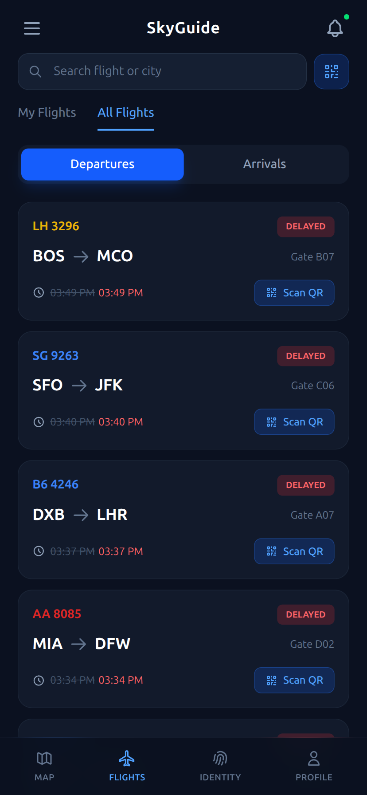
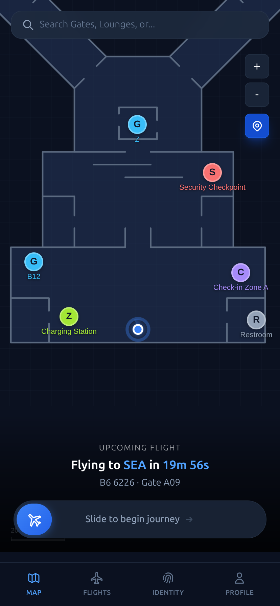
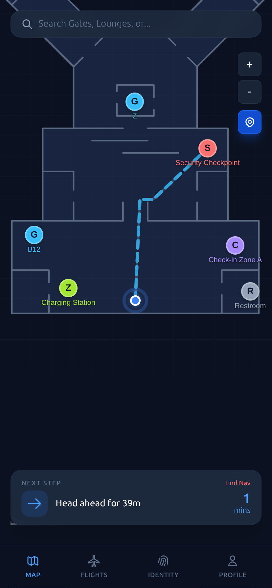
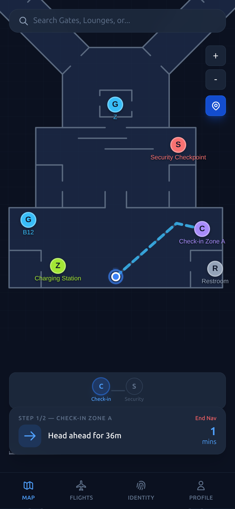

# SkyGuide

An indoor airport companion that gets you from the curb to the gate without GPS, paper boarding passes, or guessing where you're going.

SkyGuide combines **indoor dead-reckoning navigation**, **biometric digital identity**, **live flight tracking**, and an **accessibility-first UI** into a single mobile-shaped web app. Built for the hackathon as a working end-to-end prototype — real backend, real WebSockets, real push notifications, real IMU-based positioning.

---

## Screens

<table>
  <tr>
    <td align="center" width="50%">
      <br/>
      <sub><b>Flights</b> — live departures and arrivals with delay tracking; scan a boarding pass QR or type the flight number to subscribe.</sub>
    </td>
    <td align="center" width="50%">
      <br/>
      <sub><b>Upcoming flight</b> — your next subscribed flight surfaces a countdown and a one-swipe "Begin journey" CTA from the map.</sub>
    </td>
  </tr>
  <tr>
    <td align="center" width="50%">
      <br/>
      <sub><b>Indoor navigation</b> — turn-by-turn routing across the terminal graph with live blue-dot positioning and ETA.</sub>
    </td>
    <td align="center" width="50%">
      <br/>
      <sub><b>Multi-step journey</b> — check-in → security → gate, with progress dots and step-by-step instructions.</sub>
    </td>
  </tr>
</table>

---

## What it does

- **Indoor positioning without GPS.** A dead-reckoning engine fuses IMU readings (accelerometer + gyroscope) and step events into position estimates in a flat XY metre coordinate system per airport. Position updates stream over WebSockets.
- **Turn-by-turn indoor navigation.** A nav-graph (`nav_nodes` / `nav_edges`) is routed server-side; the client renders the route polyline over the terminal floor plan with POIs (gates, security, check-in, lounges, charging, restrooms).
- **Live flights.** Departures and arrivals, search by flight number / city, subscribe via QR boarding-pass scan _or_ manual flight-number entry with live autocomplete. A backend flight simulator generates realistic status churn (delays, gate changes, boarding, departures).
- **Push notifications.** VAPID-signed Web Push for status changes on subscribed flights, with a notification queue + worker on the backend.
- **Digital identity.** Face enrollment and verification (face-api.js in-browser), travel documents, and verification tokens that act as digital boarding passes against airport touchpoints.
- **Accessibility-first.** TTS announcements for flight status, haptic feedback patterns for key events, configurable accessibility profile, audio cue library.
- **AR overlay (experimental).** WebXR scene + direction arrow that points along the active route.
- **Admin & replay.** Admin panel for ops scenarios; replay engine for re-running recorded journeys against the dead-reckoning pipeline.

---

## Architecture

```
┌──────────────────────────────────────────────────────────────────┐
│  Frontend — React 18 + Vite + Tailwind + Zustand                 │
│  Leaflet (map) · three.js (AR) · html5-qrcode · face-api.js      │
└──────────────────────────┬───────────────────────────────────────┘
                           │ HTTPS  +  WebSocket  +  Web Push
┌──────────────────────────▼───────────────────────────────────────┐
│  Backend — FastAPI (async) + SQLAlchemy 2.0 + asyncpg             │
│  ├── routers/    REST API (auth, flights, navigation, identity…) │
│  ├── services/   dead_reckoning · routing · flight_simulator ·   │
│  │                push_worker · notifications · identity         │
│  └── lifespan    background tasks: push worker + flight sim      │
└──────────────────────────┬───────────────────────────────────────┘
                           │
┌──────────────────────────▼───────────────────────────────────────┐
│  PostgreSQL 16 — schema v3 (single-plane XY metres, no PostGIS)  │
│  airports · pois · nav_nodes/edges · dr_sessions · imu_readings  │
│  flights · subscriptions · users · biometric_profiles · tokens   │
│  touchpoints · notification_queue · replay_tracks · …            │
└──────────────────────────────────────────────────────────────────┘
```

### Backend modules

| Router         | Purpose |
| -------------- | ------- |
| `auth`         | JWT issuance, signup/login |
| `airports`     | Airport metadata, floor-plan images, POI catalog |
| `navigation`   | Route planning across the nav graph |
| `positions`    | WebSocket position stream (`/ws/positions/{session_id}`) |
| `imu`          | IMU sample ingestion for dead reckoning |
| `sessions`     | DR session lifecycle |
| `flights`      | Flight listing, subscriptions, status |
| `identity`     | Biometric enrollment, verification, token issuance |
| `touchpoints`  | Airport touchpoints (e.g. boarding gates) verifying digital tokens |
| `accessibility`| User accessibility profile + cue config |
| `push`         | VAPID Web Push subscribe / unsubscribe |
| `replay`       | Recorded-track playback |
| `admin`        | Ops controls & broadcasts |

### Frontend pages

`/login` · `/onboarding` · `/flights` · `/map` (navigation) · `/ar` · `/identity` · `/profile` · `/admin` · `/demo`

---

## Getting started

### Prerequisites

- Docker (for Postgres)
- Python 3.11+
- Node 20+

### One-shot dev

```bash
./seed.sh   # boots Postgres, applies schema_v3.sql, seeds demo data
./dev.sh    # starts Postgres + FastAPI (:8000) + Vite (:5173, HTTPS)
```

Open **https://localhost:5173** (accept the self-signed cert).
Demo credentials: `demo` / `hackathon2024`.

The Vite dev server proxies `/api` and `/ws` to the backend on `:8000`, so a single origin works for both HTTP and WebSocket traffic. HTTPS is required for Web Push, the camera (QR + face), and DeviceMotion / DeviceOrientation events.

### Useful endpoints

- Swagger UI — http://localhost:8000/docs
- Frontend (dev) — https://localhost:5173
- Postgres — `localhost:5432` (`postgres` / `postgres`)

### Production-style deploy

`deploy.sh` builds the frontend and serves it via the `nginx/` config in front of FastAPI. The backend also has a fallback SPA mount in `main.py` if you just want to run it without nginx.

---

## Project layout

```
hack-tech/
├── backend/
│   ├── main.py                  FastAPI app + lifespan (push worker + flight sim)
│   ├── routers/                 REST endpoints, one module per domain
│   ├── services/                dead reckoning, routing, simulator, push, notifications
│   ├── models/  schemas/        SQLAlchemy models + Pydantic schemas
│   ├── seed.py                  applies schema_v3.sql + seeds demo data
│   └── requirements.txt
├── frontend/
│   ├── src/
│   │   ├── pages/               route components (FlightsPage, MapPage, IdentityPage…)
│   │   ├── components/
│   │   │   ├── Map/             FloorMap, BlueDot, POIMarkers, RoutePolyline
│   │   │   ├── Navigation/      ETABar, JourneyProgress, InstructionBanner, SearchBar
│   │   │   ├── Identity/        FaceEnroll, FaceVerify, DocumentForm, TokenCard
│   │   │   ├── Accessibility/   TTSController, HapticController, AccessibilityPanel
│   │   │   └── AR/              ARView, XRScene, DirectionArrow
│   │   ├── api/client.js        axios + WebSocket helpers
│   │   ├── store/               Zustand stores
│   │   └── hooks/  services/
│   └── vite.config.js           HTTPS dev, /api + /ws proxy
├── schema_v3.sql                authoritative Postgres schema
├── docker-compose.yml           Postgres only
├── nginx/                       prod reverse proxy
├── dev.sh   seed.sh   deploy.sh
└── docs/screenshots/            UI screenshots used in this README
```

---

## Notable design choices

- **Single-plane XY metres, no PostGIS.** Every airport has a `px_per_metre` and a floor-plan image; everything else (POIs, nav nodes, position estimates) lives in flat metres. Keeps queries trivial and the schema portable.
- **Dead reckoning over GPS.** GPS is useless indoors; the IMU pipeline + step events + nav-graph snapping gets the blue dot to the right corridor without any beacons.
- **Backend flight simulator.** Status changes are generated live so the UI has something to react to (delays, gate moves, boarding calls) — wired through to push notifications and TTS.
- **Web-first, install-free.** No native app — it's a PWA-shaped React build. Camera, motion sensors, and push all run from a browser on HTTPS.
- **Accessibility wired into the data model.** Audio cues and haptic patterns are first-class tables, not afterthoughts on the client.

---

## Tech stack

**Frontend** — React 18, Vite, Tailwind v4, React Router, Zustand, Leaflet, three.js, html5-qrcode, face-api.js, qrcode.react

**Backend** — FastAPI, SQLAlchemy 2.0 (async), asyncpg, Pydantic v2, python-jose (JWT), passlib + bcrypt, pywebpush (VAPID)

**Infra** — PostgreSQL 16, Docker Compose, nginx (prod), self-signed HTTPS in dev
